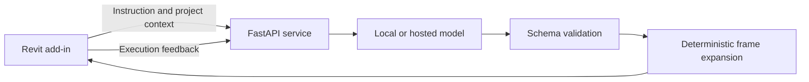

# Revit Assistant

**Your model. Your provider. Your workspace.**

An open-source Revit add-in and Python service for turning natural-language
instructions into structured BIM operations. Run your model locally or connect
an OpenAI-compatible provider with your own credentials.

[Getting started](#quick-start) | [Configuration](docs/configuration.md) |
[Architecture](docs/architecture.md) | [Contributing](CONTRIBUTING.md)

## What you can build

- Walls, doors, windows, structural columns and beams.
- Parametric frames expanded deterministically into individual elements.
- Instructions grounded in project levels, loaded families and selected IDs.
- Clarification questions and execution feedback with per-action rollback.

Example instructions:

> Create a 5 meter wall from (0, 0) to (5, 0).
>
> Create a structural frame with 3 bays in X and 2 bays in Y, spaced 5 meters apart.

**Status: experimental.** Review generated operations in a disposable model first.
Separate Windows builds target **Revit 2024, 2025 and 2026**. Runtime behavior
still needs validation inside each Revit release. Revit and third-party model
services are licensed separately.

## Quick Start

### For Users

**The Revit add-in runs on Windows.** The Python backend can run on Windows,
macOS or Linux. For the simplest setup, run both on the same Windows computer.
Revit has no native macOS version; see
[Autodesk's system requirements](https://www.autodesk.com/support/technical/article/caas/sfdcarticles/sfdcarticles/System-requirements-for-Revit-2026-products.html).

1. Install Python 3.11+ and download this repository.
2. On Windows, double-click `start-backend.bat`. On Mac, open `start-backend.command`.
3. On first launch, choose your provider, model name and personal key. Dependencies
   are installed automatically; the key is hidden while typing and stored in `.env`.
4. On Windows, extract the ZIP matching Revit 2024, 2025 or 2026 and run `install.bat`.
5. Keep the backend window open, start Revit and select **BIM AI > Run AI**.

Local Ollama requires installing Ollama and downloading a model first. Hosted
providers can charge for inference. Subsequent launches reuse your configuration.
On Mac, you can run the backend and develop the project, but the add-in must be
installed in Revit running under Windows. A Windows VM or remote Windows computer
still requires a working Revit installation; this project has not validated VM setups.

### Manual Setup

Requires Python 3.11+ and an OpenAI-compatible model endpoint.

```sh
python -m venv .venv
# macOS / Linux
source .venv/bin/activate
# Windows PowerShell: .venv\Scripts\Activate.ps1
pip install -r requirements.txt
cp .env.example .env
# Windows PowerShell: Copy-Item .env.example .env
```

Edit `.env`: set `LLM_MODEL` to your model identifier, and configure the URL and
key for your provider. For local Ollama, install and download a model yourself,
then use its installed name. See the [provider examples](docs/configuration.md).

```sh
uvicorn app.main:app --host 127.0.0.1 --port 8000
```

Open <http://127.0.0.1:8000/docs> for the interactive API and
<http://127.0.0.1:8000/health> for service health.

Alternatively, run `docker compose up --build` after configuring `.env`.
For a model running on the host, use
`LLM_BASE_URL=http://host.docker.internal:11434/v1` and make sure the model server
accepts connections from Docker. The backend port is exposed only on loopback.

### Build And Install The Add-in

On Windows with the .NET 8 SDK, choose your installed Revit release:

```powershell
./scripts/package-addin.ps1 -RevitVersion 2024
./scripts/package-addin.ps1 -RevitVersion 2025
./scripts/package-addin.ps1 -RevitVersion 2026
```

Extract the matching ZIP from `dist/`, close Revit and run its `install.bat`.
Each package registers only its own Revit version and uses a separate installation
directory, so the three builds can coexist. Windows CI produces the same ZIPs.
For build-only commands and output paths, see [the build guide](docs/building.md).
Start the backend before opening Revit. The add-in connects to
`http://127.0.0.1:8000` by default. Use `BIM_BACKEND_URL` to choose another server.

## Design



The model proposes data, not executable source code. Revit changes go through
explicit handlers and transactions. No account or database is required.
Provider credentials stay in the backend environment; they are not part of requests.

## Current Limits

- Move and delete schemas exist, but their Revit handlers are not implemented.
- Wall thickness and door/window dimensions are not applied by the current handlers.
- Multi-floor placement and family/type resolution need further validation.
- Existing geometry is not yet included in project context.
- Automatic retries may repeat successful operations; inspect the resulting model.
- Section suggestions are heuristics, not verified Eurocode structural calculations.
- Requests currently block the Revit command while waiting for the model.

## Development

```sh
python -m unittest discover -s tests -v
```

Contributions that improve geometry, type resolution, provider compatibility and
installation are welcome. See [CONTRIBUTING.md](CONTRIBUTING.md).

## License

[MIT](LICENSE). Free to use, modify and integrate, including commercial projects.
Hosted inference can incur provider charges; local inference requires your own hardware.
This project is independent and is not affiliated with Autodesk.
